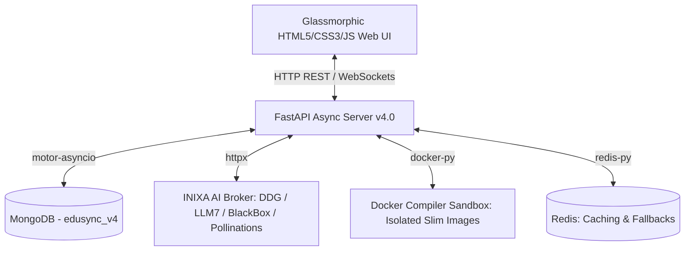
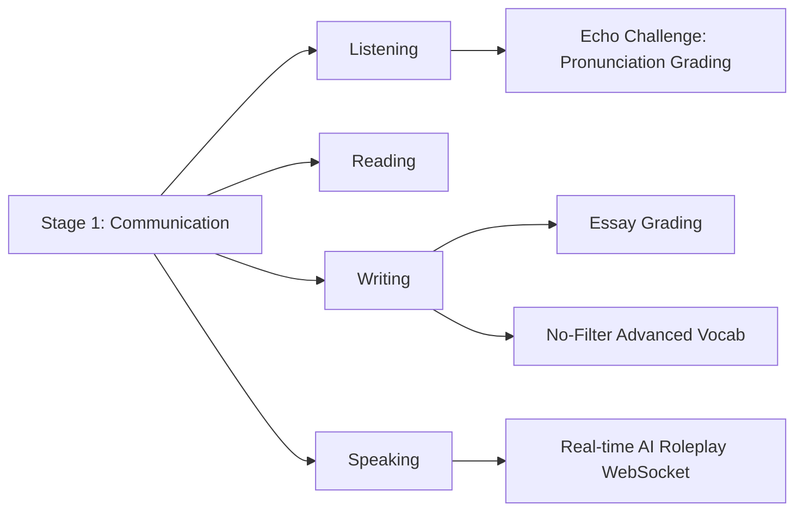

# EduSync 4.0: Enterprise AI-Powered Learning Platform
## Comprehensive Technical & Functional Documentation

**Project Name:** EduSync v4.0 (Enterprise AI Node)  
**Architecture:** Modular Asynchronous Backend (FastAPI) & Glassmorphic Web Frontend  
**Created By:** Inixa AI Development Team  
**Date:** June 2, 2026  
**Status:** Release Ready / Production-Grade v4.0.0  

---

## Table of Contents
1. [Executive Summary & Project Vision](#1-executive-summary--project-vision)
2. [High-Level System Architecture](#2-high-level-system-architecture)
3. [The INIXA AI Engine (5-Engine Smart Fallback)](#3-the-inixa-ai-engine-5-engine-smart-fallback)
4. [Database & Data Models Schema](#4-database--data-models-schema)
5. [Role-Based Functional Dashboards](#5-role-based-functional-dashboards)
6. [Specialized Learning Modules & Workflows](#6-specialized-learning-modules--workflows)
7. [Real-time Collaboration & WebSocket Layer](#7-real-time-collaboration--websocket-layer)
8. [Docker Sandbox Online Compiler](#8-docker-sandbox-online-compiler)
9. [B2B Licensing, Credits & Subscriptions](#9-b2b-licensing-credits--subscriptions)
10. [Setup, Deployment & Testing Guide](#10-setup-deployment--testing-guide)

---

## 1. Executive Summary & Project Vision

EduSync 4.0 is a next-generation Learning Management System (LMS) and AI-driven skill-building portal. 

### Core Value Proposition
* **Zero API Cost Model:** Traditional LMS platforms rely heavily on proprietary models (e.g., OpenAI GPT-4, Google Gemini Pro) costing upwards of ₹3.5 Lakhs/month for a 10,000-user campus. EduSync integrates a custom **5-Engine Smart Fallback** mechanism that utilizes high-speed, zero-cost, token-free public AI endpoints.
* **Private Campus AI Node (B2B Setup):** For premium deployments, institutions purchase a physical liquid-cooled AI super-node containing **4x NVIDIA RTX 5090 (128GB total VRAM)** and a AMD Threadripper 7980X. This runs local models (e.g., Gemma 3, Llama 3) for up to **1,50,000 concurrent students**, providing absolute data sovereignty, low-latency, and zero cloud hosting overhead.
* **End-to-End Skill Development:** The application divides learning paths into chronological phases (Stages):
  * **Stage 1 (Communication):** Echo reading, writing challenges, speech analysis, real-time roleplay AI.
  * **Stage 2 (Coding & Arcade):** Gamified programming tasks, leaderboard, compiler.
  * **Stage 3 (Collaboration):** WebSocket-driven pair programming, repository version control, project workspaces.
  * **Stage 4 (Career Prep):** Resume checks, LinkedIn strength audit, alumni networks, jobs matcher.

---

## 2. High-Level System Architecture

The project is designed with a decoupling between the client side and the server side:



### Key Technical Stack Components:
1. **Frontend Layer:** Vanilla HTML5 structured layout with custom Modern Glassmorphic style sheets (using blur filters, keyframe micro-animations, and fluid CSS variables). Interactivity is handled via asynchronous vanilla JavaScript.
2. **Asynchronous Backend (FastAPI):** Built on ASGI (Python 3.11) utilizing non-blocking route handlers (`async/await`) and asynchronous dependencies.
3. **Database (MongoDB):** Managed asynchronously via `motor.motor_asyncio.AsyncIOMotorClient` on port `27017` with detailed compound and sparse indexes configured on bootstrap.
4. **Caching & Queue Broker (Redis):** Handles session tokens, concurrency limits, real-time message fallbacks, and execution counters.
5. **Sandboxed Compiler:** Dynamic code evaluation through a localized Docker SDK connection, spinning up slim, CPU/memory-restricted containerized environments for safe execution of multiple languages.

---

## 3. The INIXA AI Engine (5-Engine Smart Fallback)

The core innovation of EduSync 4.0 is the **Inixa AI Engine Service** (`app/services/ai_wrapper.py`). To avoid costly cloud keys, a custom fallback broker (`AIModelWrapper`) intercepts all AI calls and automatically checks five public, unrestricted API endpoints in order:

```
[Incoming AI Request]
         │
         ▼
[1. DuckDuckGo CF Worker] ──(Success?)──► [Return Content]
         │ No
         ▼
[2. LLM7 API]             ──(Success?)──► [Return Content]
         │ No
         ▼
[3. BlackBox AI]          ──(Success?)──► [Return Content]
         │ No
         ▼
[4. Pollinations OpenAI]  ──(Success?)──► [Return Content]
         │ No
         ▼
[5. Pollinations Simple]  ──(Success?)──► [Return Content]
         │ No
         ▼
[Offline Error Message]
```

### The 5 Free Engines Configuration:
* **Engine 1: DuckDuckGo Cloudflare Worker:** Intercepts traffic via a lightweight worker proxy to fetch GPT-4o-mini completions.
* **Engine 2: LLM7 API:** Endpoint targeting `api.llm7.io` running high-speed gpt-4o-mini completions.
* **Engine 3: BlackBox AI:** Direct POST endpoint returning answers while automatically scrubbing out Blackbox-specific Markdown link annotations.
* **Engine 4: Pollinations AI:** OpenAI-compatible API base (`text.pollinations.ai/openai`) providing generic LLM inference.
* **Engine 5: Pollinations Simple:** Plain text fallback interface to Pollinations (`text.pollinations.ai`).
* **Image Generation:** Integrated through Pollinations Image API (`image.pollinations.ai/prompt`).

### Backward Compatibility Wrapper:
To allow this free framework to work as a drop-in replacement for the deprecated Google Gemini or Ollama setups, the backend exports an `AIModelWrapper` class mimicking the official `google-generativeai` SDK:
```python
class AIModelWrapper:
    def generate_content(self, contents, **kwargs):
        # Translates Gemini-style requests to standard prompt strings
        # Executes the asynchronous fallback loop inside a synchronous thread pool
        ...
    async def generate_content_async(self, contents, **kwargs):
        # Standard async router
        ...
```

---

## 4. Database & Data Models Schema

The MongoDB database `edusync_v4` registers over **50 database collections** dynamically managed via AST-generated schema classes in `app/models/`.

### Critical Collections Index Configuration:
To ensure high-performance lookups across large student bodies, several indexes are built on start-up (`app/database.py`):

| Collection | Index Fields | Properties |
| :--- | :--- | :--- |
| `users` | `email` | Unique |
| `users` | `roll_number` | Unique, Sparse (filters Null values) |
| `users` | `department`, `year` | Compound Index |
| `challenges` | `stage`, `difficulty` | Compound Index |
| `submissions` | `user_id`, `challenge_id` | Compound Index |
| `submissions` | `challenge_id`, `score` (desc) | Compound Index (Leaderboards) |
| `notifications`| `user_id`, `read` | Compound Index (Inbox) |
| `roleplay_sessions`| `session_id` | Unique |

---

## 5. Role-Based Functional Dashboards

EduSync employs strict Role-Based Access Control (RBAC) featuring four primary user roles:

### A. Student Dashboard (`student_dashboard.html` / `app/routes/student/`)
* **Classroom Interface:** Join virtual classrooms, review study materials, and download materials uploaded by teachers.
* **Assignments & Submissions:** Submit assignments directly, triggering the sandbox compiler or the AI grader to generate real-time evaluations.
* **Announcements Feed:** Real-time school/department broad announcements.
* **Daily Quizzes & Gamification:** Earn credits by solving short daily multi-choice quiz blocks.

### B. Faculty Dashboard (`faculty_dashboard.html` / `app/routes/faculty/`)
* **Classroom Orchestrator:** Create and manage classrooms, assign unique join codes, and control enrollment.
* **Assignments & Grading:** Post programming or communication assignments and view submitted student files. Includes an **AI Grading Assistant** that evaluates submissions for readability, correctness, and optimization, outputting scores and recommendations.
* **Attendance Ledger:** Log and audit student attendance records.
* **Scheduler:** Manage department classes, laboratories, and examination schedules.
* **Faculty AI Assistant:** Dedicated route to brainstorm lesson plans, generate course curriculums, and draft test questions.

### C. HOD (Head of Department) Dashboard (`hod_dashboard.html` / `app/routes/hod/`)
* **Department Analytics Hub:** Review aggregate graphs detailing student performance, attendance rates, and active assignments across the department.
* **Faculty Performance Audit:** Track the active assignments created, classroom count, and average course scores for each faculty member.
* **Curriculum Approvals Workflow:** Approve or reject course additions and curriculum updates.
* **Resource & Software Licensing:** Request infrastructure hardware or software licenses (e.g., MATLAB, JetBrains, AWS credits).
* **Maintenance Tracker:** Schedule and monitor IT maintenance requests for computer labs.
* **HOD AI Auditor:** Ask custom business intelligence questions about department progress and generate PDF reports.

### D. Admin Dashboard (`admin.html` / `app/routes/admin/`)
* **User Management:** Create new student/faculty accounts, reset passwords, and suspend or reactivate accounts.
* **Global Challenge Creator:** Author coding challenges and communication tasks distributed platform-wide.
* **System Metrics Monitor:** Review server logs, CPU/Memory load, and overall credit usage.

---

## 6. Specialized Learning Modules & Workflows

### Phase 1: Communication Skills
Stage 1 is divided into four skill components designed to prepare students for corporate placement.



* **Listening Module:**
  * *Echo Challenge:* User plays an audio prompt and records their repetition. Backend uses speech recognition to score pronunciation.
  * *Fill the Beats:* Dynamic audio playback with transcript gaps.
  * *Direction Follower:* Trace paths on a grid based on audio instructions.
  * *Tone Recognizer:* Identify professional/emotional tone in short clips.
* **Reading Mastery:** Comprehensive reading prompts evaluated by multiple-choice questionnaires.
* **Writing Excellence:**
  * *Essay Challenges:* Real-time evaluation of grammar, spelling, structure, and vocabulary.
  * *No-Filter Challenge:* Rewrite paragraphs utilizing advanced synonyms without triggering "banned" common words (e.g., "very", "good").
  * *Quick Reply Time Attack:* Draft business emails under strict time constraints.
* **Speaking Fluency:**
  * *AI Conversation Partner:* Dynamic audio-to-text chat simulating real-life speaking practice.
  * *English Learning Chatbot:* Dedicated tabs for General assistance, Conversation, Grammar correction, and Pronunciation.
  * *Vocabulary builder:* Digital flashcards offering dual English/Tamil explanations, vocabulary categories, and examples.

---

## 7. Real-Time Collaboration & WebSocket Layer

EduSync implements dynamic WebSocket pathways (`app/routes/websockets.py`) to connect users in real time:

1. **Group Chat / Classroom Channels (`/api/ws/{connection_id}`):**
   * Manages group message relays.
   * **AI Trigger:** Intercepts messages prefixing `@assistant` to trigger a query to the `AIService` and broadcast responses.
2. **Pair Programming Rooms (`/api/ws/{connection_id}`):**
   * Synchronizes programming workspaces in real time.
   * Relays live code changes and updates cursor positions (line/column) to participants.
3. **Stage 1 Roleplay Sessions (`/api/ws/stage1/roleplay`):**
   * Initiates simulated interviews or client meetings.
   * Streams responses character-by-character to create typing effects.
   * Real-time speech metrics analysis: Calculates words-per-minute (WPM) and detects filler words (e.g., "um", "ah", "like").

---

## 8. Docker Sandbox Online Compiler

Code submission is executed inside isolated Docker containers (`app/services/compiler_service.py`) to prevent system damage.

### Supported Language Sandboxes:
* **Python 3.11-slim:** Runs scripts using `python {filename}`.
* **Node 18-slim:** Runs JavaScript utilizing `node {filename}`.
* **OpenJDK 17-slim:** Compiles with `javac` and executes `java Main`.
* **GCC 12:** Compiles and runs C (`gcc {filename} -o main`) and C++ (`g++ {filename} -o main`).
* **Golang 1.21:** Runs using `go run {filename}`.
* **Rust 1.70:** Compiles with `rustc` and executes the binary.

### Safety Limits:
* **CPU Limit:** 1.0 core.
* **Memory Limit:** 512MB RAM.
* **Timeout Threshold:** 30 seconds.
* **Disk Mounting:** Uses read-only temporary file mounts to restrict host environment access.

---

## 9. B2B Licensing, Credits & Subscriptions

For commercial deployments, EduSync incorporates a B2B business license and credit management system (`app/routes/licensing.py`):

1. **License Audits:** College admins activate platform installations via hashed license keys. The backend verifies status, student caps, and expiry dates.
2. **Credit Refills:** Students consume credits to use advanced features (e.g., AI Mock Interviews, Compiler runs).
3. **Refill Workflow:** HODs submit department-wide credit requests to college administrators, who approve and provision refill credits.
4. **Usage Analytics:** Generates reports tracking credit usage patterns across classrooms, departments, and individual students.

---

## 10. Setup, Deployment & Testing Guide

### Prerequisites
* **Python:** Version 3.10 or 3.11.
* **Database:** MongoDB (Running locally on `localhost:27017`).
* **Broker:** Redis (Running locally on `127.0.0.1:6379`).
* **Containers:** Docker (To run the compiler service).

### Environment Setup
Create a `.env` file in the project root:
```env
SECRET_KEY=your_secure_jwt_secret_key_here
REDIS_URL=redis://127.0.0.1:6379
RAPIDAPI_KEY=optional_linkedin_jobs_api_key
RAPIDAPI_HOST=linkedin-jobs-search.p.rapidapi.com
```

### Dependency Installation
Install python modules:
```bash
pip install -r requirements.txt
```

### Running the Server
Start the FastAPI server:
```bash
# Debug/Reload mode:
python main.py

# Production mode:
uvicorn main:app --host 0.0.0.0 --port 8000 --workers 4
```

### Accessing Swagger API Documentation
Open your browser and navigate to:
* **Swagger UI:** `http://localhost:8000/api/docs`
* **Redoc UI:** `http://localhost:8000/api/redoc`

### Seeding Mock Data
On bootstrap, `app/database.py` automatically checks for existing records. If the database is empty, it populates it with:
* **Admin User:** `admin@edusync.com` (Password: `admin123`)
* **Faculty User:** `hatakekakashi@edusync.com` (Password: `password123`)
* **Student Users:** `naruto@edusync.com` (Password: `password123`), `sasuke@edusync.com` (Password: `password123`)
* **Sample Coding Challenge:** "Hello World in Python"
* **Sample Jobs:** Technical junior roles in Chennai and Bangalore.
