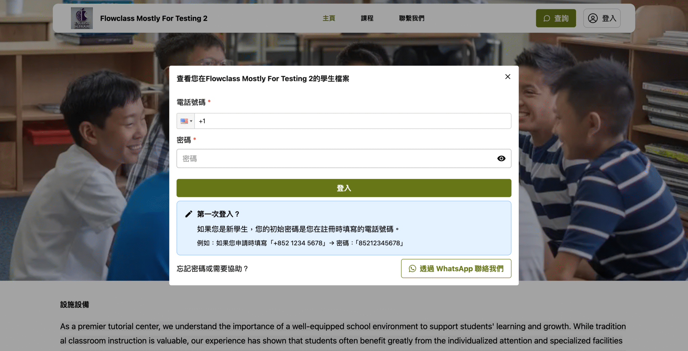
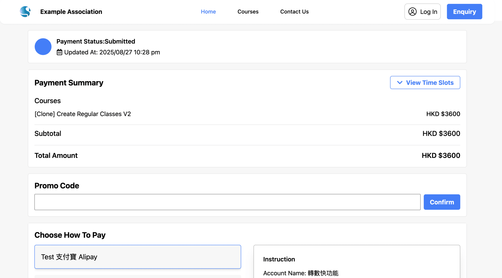
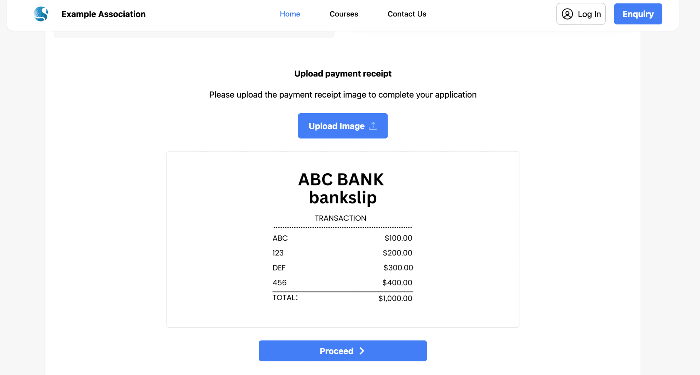
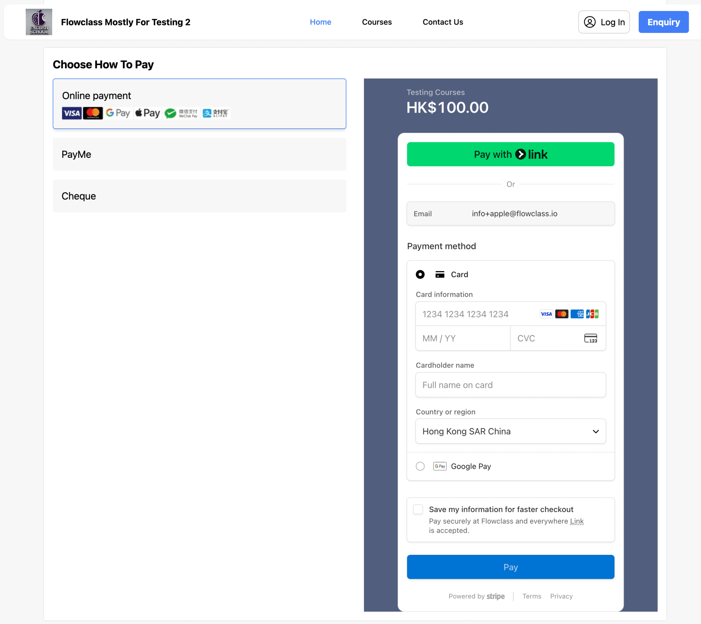
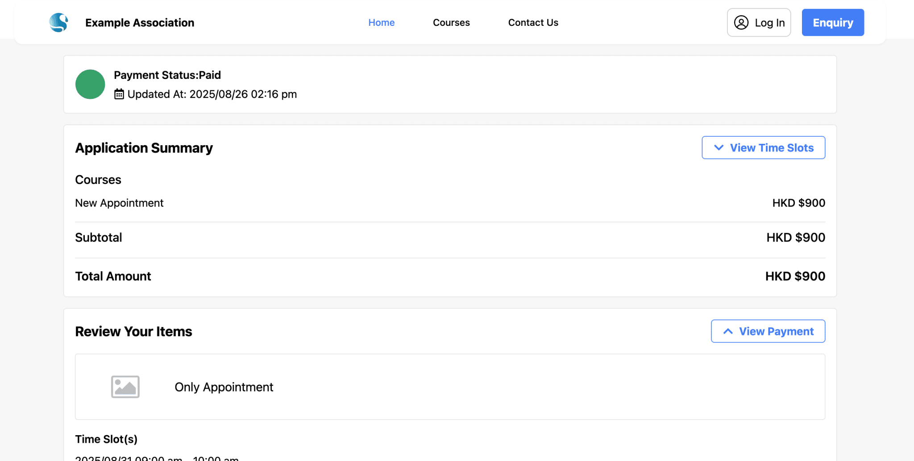
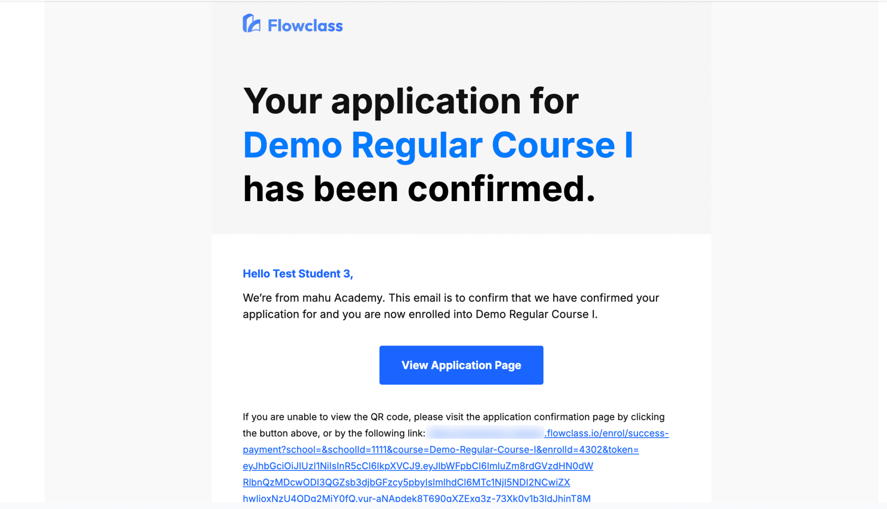
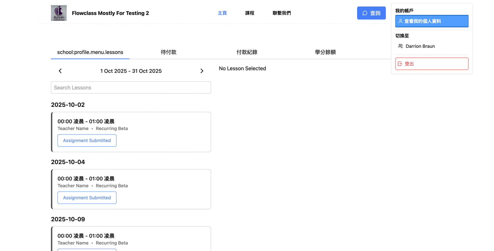
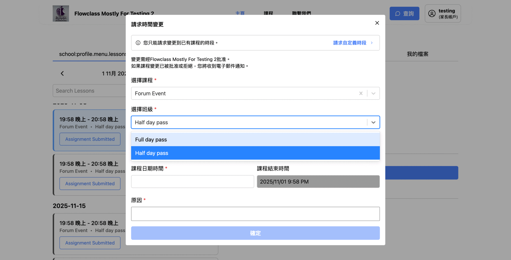

# Flowclass

Flowclass is an open-source operations platform built for education businesses — tutorial centres, training academies, and small-to-medium schools that need more than a spreadsheet but less than an enterprise ERP.

## Our Story

We spent two years building Flowclass as a SaaS product — a single platform for small to medium education companies and tutorial centres to automate their payments, scheduling, and student management.

Over time, we realised that every education business runs differently. A music school works nothing like a coding bootcamp. A tutoring centre has workflows that a language school would never recognise. A SaaS with fixed opinions on how things should work just isn't scalable across that kind of diversity.

So we pivoted. We moved to an enterprise model — per-contract, customised on top of our core Flowclass software — and focused on building a platform flexible enough to fit each client's actual operations. We still host Flowclass for our clients, but all future development happens here, in the open, with the community.

The goal is simple: build the operations system that fits every education business.

## What's Included

Flowclass ships with a full suite of modules out of the box:

- **Class types** — regular, recurring, and flexible schedule types to match how you actually run classes
- **Application platform** — student enrolment flows with custom fields and approval stages
- **Online payment integration** — Stripe-powered payments with receipt upload and verification
- **Invoicing** — generate, track, and manage invoices per student or class
- **Student CRM** — full student records, enrolment history, and communication log
- **Promotions** — coupons, package discounts, and more
- **Email notifications** — automated emails triggered by enrolments, payments, and reminders
- **And much more** — reporting, materials, scheduling, and integrations

## Screenshots

















## Self-hosting

Anyone can run Flowclass on a single 8 GB instance with Docker installed:

```bash
git clone https://github.com/your-org/flowclass-open-source
cd flowclass-open-source
pnpm start
```

That's it. The start script handles Docker, dependencies, and all three apps (web, API, admin).

---

## Quick Start

PostgreSQL is required and must run via Docker. Use the start script to run the entire application:

```bash
pnpm start
```

This script will:

1. Check that Docker is running (on macOS, start Docker Desktop automatically if needed)
2. Start PostgreSQL, SMTP (Mailpit), and CloudBeaver via Docker
3. Create `.env` from `.env.example` if missing
4. Install dependencies and start all apps (web, api, admin)

## Environment

A single `.env` file at the project root is used by all apps. Copy from the template:

```bash
cp .env.example .env
```

Edit `.env` with your database credentials and any other required values.

**URLs:** Three variables for the three apps: `API_BASE_URL` (API), `NEXT_PUBLIC_WEB_BASE_URL` (Web), `VITE_ADMIN_BASE_URL` (Admin). When Web/Admin vars are not set, they default to the same domain as the current page (`window.location.origin`).

## Ports

| App         | Port | URL                    |
|-------------|------|------------------------|
| API         | 3100 | http://localhost:3100  |
| CloudBeaver | 3101 | http://localhost:3101  |
| Admin       | 3000 | http://localhost:3000  |
| Web         | 3001 | http://localhost:3001  |

## CloudBeaver (Database Management)

CloudBeaver provides a web UI for managing the PostgreSQL database. Run `pnpm start` first to ensure Postgres and CloudBeaver are running.

1. Open http://localhost:3101
2. On first run, create an admin account (username and password of your choice)
3. Add a new database connection:
   - **Connection type:** PostgreSQL
   - **Host:** `postgres` (the Docker service name, not `localhost`)
   - **Port:** `5432`
   - **Database:** `flowclass`
   - **Username:** `postgres`
   - **Password:** `postgres`

## Common Commands

```bash
pnpm start        # Run entire app (Docker + install + dev)
pnpm dev          # Start all apps (web, api, admin)
pnpm dev:web      # Start web only
pnpm dev:api      # Start API only
pnpm dev:admin    # Start admin only
pnpm build
pnpm lint
pnpm type-check
pnpm test
pnpm evaluate:functionality
```

## Docker Deployment

```bash
docker compose up --build
```

This Docker setup runs:

- `postgres` for the primary database (data persists in a Docker volume named `postgres-data`)
- `cloudbeaver` at http://localhost:3101 for database management (see [CloudBeaver](#cloudbeaver-database-management) above)
- `api` on `http://localhost:3100`
- `admin` on `http://localhost:3000`
- `web` on `http://localhost:3001`

Uploaded media is stored in a Docker named volume `media-data` (mounted at `/workspace/uploads` in the API container) and served by the API (`/media/file/*`). CloudBeaver data (connections, settings) persists in `cloudbeaver-data`. Data persists across container restarts. No S3 bucket is required.

## Manual Setup

If you prefer to run services manually instead of `pnpm start`:

```bash
docker compose up postgres smtp cloudbeaver -d
pnpm install
cp .env.example .env
pnpm dev
```

## Open-Source Mode Defaults

This repository is configured for open-source distribution:

- subscription/paywall flows are disabled in this open-source build
- no production secrets are stored in source control
- environment variables must be provided via the root `.env` file (copy from `.env.example`)

## Workspace Layout

- `apps/web` — Next.js frontend
- `apps/api` — Nest.js backend
- `apps/admin` — Vite + React admin app

## Prerequisites

- **Node.js 24** (use `nvm use` or `fnm use` if you have `.nvmrc` / `.node-version`)
- **pnpm** (>=10)
- **Docker** (for PostgreSQL and SMTP)

## Contributing

1. Fork and clone the repository.
2. Create a branch for your change.
3. Run lint, type-check, and functional evaluation before opening a PR.
4. Submit a PR with a clear test plan.

## Licenses

- Root open-source code: MIT (`LICENSE`)
- Self-host/server copyleft terms: AGPL-3.0 (`LICENSE-AGPL`)

---

## Documentation & Guide

Full documentation is available at **[flowclass.io/docs](https://flowclass.io/docs)**, including:

- **Getting started** — environment setup, first run, and configuration
- **Architecture overview** — how the web, API, and admin apps fit together
- **Self-hosting guide** — deploying with Docker and configuring your environment
- **Contributing guide** — code style, branching, and PR process

For the fastest path from zero to a running instance, start with the [Getting Started](https://flowclass.io/docs) guide before working through the sections below.

> For full product details, screenshots, and customer stories, visit **[flowclass.io](https://flowclass.io)**.